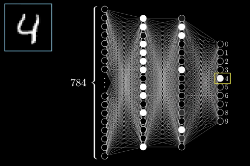

# AI
## vocabulary

## theory
### what is AI
AI
1. The theory and development of computer systems able to perform tasks normally requiring human intelligence;能执行通常需要人类智能的任务的计算机系统的理论和发展;
2. Enabling a machine or system to sense, reason, act, or adapt like a human being.使机器或系统能像人一样感知、推理、行动或适应。

Machine Learning
1. A means of producing/developing AI.一种生产/开发人工智能的手段。
2. Using machines to extract knowledge from data and learn from it autonomously.使用机器从数据中提取知识并自主学习
3. The computers “learn” without being explicitly programmed to do so计算机在没有明确编程的情况下“学习”

Deep Learning
1. A subset of ML that uses large-scale artificial neural network models.机器学习的一个子集，它使用大规模人工神经网络模型。
2. These try to mimic the learning process of the human brain. 它们试图模仿人类大脑的学习过程。
3. Often requires large amounts of data and specialised GPUs for training.通常需要大量的数据和专门的gpu进行训练。

Machine learning pipeline: testing/prediction机器学习管道:测试/预测

### AI Risks
1. AI attack surface is massive and growing. 人工智能的攻击面是巨大的，而且还在不断增长
2. As AI becomes more embedded in critical infrastructure and cyber-physical systems, it becomes an increasingly vulnerable to attack随着人工智能越来越多地嵌入关键基础设施和网络物理系统，它变得越来越容易受到攻击
3. Although attacks on AI have been known for some time, threats are largely ignored尽管对人工智能的攻击已经有一段时间了，但威胁在很大程度上被忽视了
   1. Our understanding of threat models of AI is poor我们对人工智能威胁模型的理解很差
   2. AI is usually a “black box” and so attacks are hard to detect人工智能通常是一个“黑盒子”，因此攻击很难被发现
4. There has been a focus on weaknesses of machine learning and AI without credible threats that would exploit them人们一直关注机器学习和人工智能的弱点，而不是利用它们的可信威胁
5. This is changing as machine learning is increasingly used in cybersecurity defense随着机器学习越来越多地用于网络安全防御，这种情况正在发生变化
   1. Spam, phishing, network intrusion, AV, threat detection, vulnerability scanning垃圾邮件，网络钓鱼，网络入侵，反病毒，威胁检测，漏洞扫描

### The machine learning framework
1. Training: given a training set of labeled examples, estimate the prediction function f by minimizing the prediction error (cost) on the training set训练:给定一个训练集的标记样例，通过最小化训练集上的预测误差(成本)来估计预测函数f
2. Testing: apply f to a never before seen test example x and output the predicted value y=f(x)测试:将f应用于从未见过的测试示例x，并输出预测值y=f(x)

### Machine learning uses
1. Machine learning is finding application in almost all computer software机器学习在几乎所有的计算机软件中都得到了应用
2. Speech recognition and natural language processing2. 语音识别和自然语言处理
Siri, Alexa, Google Assistant
3. Computer vision 计算机视觉
Robots and autonomous vehicles机器人和自动驾驶汽车
4. Image analysis 图像分析
Facial and general object recognition, image manipulation面部和一般对象识别，图像处理
5. Decision support决策支持
Risk analysis, medical decisions, cyber security, finance风险分析，医疗决策，网络安全，金融
6. Research
Computational biology, astrophysics计算生物学，天体物理学

### Digit Classification数字分类
1. Each hand written number is captured as a 28 x 28 = 784 pixel image with a grayscale number for each pixel每个手写数字被捕获为28 x 28 = 784像素的图像，每个像素有一个灰度值
2. 4 Layer neural network4层神经网络
Input layer: Ideally, first hidden layer would recognise segments of lines输入层:理想情况下，第一个隐藏层将识别线段
2 hidden layers: 2nd hidden layer would recognise combined segments输入层:理想情况下，第一个隐藏层将识别线段
1 output layer1输出层
3. 784 inputs for each pixel of a digit image数字图像的每个像素有784个输入
4. 10 outputs – range of possible numbers10个输出-可能的数字范围

### Attacks: Adversarial Inputs敌对的输入
1. A non-visible alteration of an image that causes the neural network to misclassify the image导致神经网络对图像进行错误分类的图像的不可见变化
2. The exact perturbation depends on whether the attacker has access to the underlying neural network model确切的扰动取决于攻击者是否能够访问底层神经网络模型
3. Vulnerability that has received much attention from researchers脆弱性受到了研究人员的广泛关注

### Adversarial Attacks
#### One-pixel Attacks像素攻击
1. Extreme case: only 1 pixel in the image is changed to fool the classifier极端情况:只改变图像中的1个像素来欺骗分类器
2. Results showed 3 different models were fooled on 70.97% of test images结果表明，3种不同的模型在70.97%的测试图像上被愚弄
3. 97.47% average confidence on false classification对错误分类的平均置信度为97.47%
#### Physical Attacks物理攻击
1. Developed 3D printed eyeglasses to fool facial biometric systems开发3D打印眼镜，骗过面部生物识别系统
2. Attacks are physically realizable and relatively inconspicuous攻击在物理上是可以实现的，而且相对不明显
3. Road Sign Misclassification道路标志分类错误
4. Adversarial 3D Objects对抗性3D对象
3D printed objects constructed that are adversarial over an entire distribution of image/object transformations构建的3D打印对象在图像/对象转换的整个分布上是对抗的
5. Adversarial Patch敌对的补丁
Sticker designed so that when placed into the scene, the object is misclassified贴纸的设计使放置到场景中时，物体被错误分类
Sticker is publicly available for download and print贴纸是公开下载和打印

### General Black Box problems
If a deep neural network is not interpretable then we don’t know if it is:如果一个深度神经网络是不可解释的，那么我们不知道它是否可以解释:
Biased - especially when the bias concerns a “sensitive” feature like race or gender有偏见——尤其是当偏见涉及种族或性别等“敏感”特征时
Not explainable – if a company or individual asks how a particular decision was made, it is not possible to do so不可解释——如果一个公司或个人问一个特定的决定是如何做出的，那是不可能的
Working as expected e.g. husky vs wolf工作如预期，如哈士奇对狼
Often, researchers have no access to the details of machine learning algorithm or training data通常，研究人员无法获得机器学习算法或训练数据的细节
Is it possible to check the model without these things?

### Deepfakes深度伪造
Synthetic media generated by AI methods, used to create falsified content: faces, body, speech, emotions, etc.人工智能方法生成的合成媒体，用于创建伪造的内容:面部、身体、语言、情绪等。

### ChatGPT: Prompt Injections提示注射
Vulnerability in prompt-based language models基于提示的语言模型中的漏洞
Model adjusts behaviour through conversation- examples/instructions given via prompts模型通过对话调整行为-通过提示给出的示例/指令
Attackers inject malicious instructions into input fields, causing unexpected actions.攻击者将恶意指令注入输入字段，导致意外操作
Vulnerability is inherent: the combination of pre-written instructional prompt with untrusted input from elsewhere; that's just how these models work!漏洞是固有的:预先编写的指示提示与来自其他地方的不可信输入的组合;这就是这些模型的工作原理!

### AI: Ethics and Implications AI:伦理和影响
AI Systems are tools for use in applicable settings.人工智能系统是在适用环境中使用的工具。
Tools are created with certain intentions in mind.工具是在特定的意图下创建的。
The use, or misuse, of these tools is up to the end user.这些工具的使用或误用取决于最终用户。
However, does the existence of the tool itself promote its misuse?然而，工具本身的存在是否促进了它的误用?
Regulations, limitations on the use of AI?对人工智能使用的规定和限制?
Is AI technology progressing too quickly?人工智能技术是否发展过快?

## Q&Defences:
1. Modify AI systems to make them harder to attack修改AI系统，使其更难被攻击
Train on adversarial inputs; Model input constraints; Use more robust algorithms; Physical barriers to attack; Manual monitoring of system use, vetting, etc. Increased digital security for some applications (MFA)对抗性输入的训练;模型输入约束;使用更稳健的算法;攻击的物理障碍;手动监控系统的使用、审核等。提高某些应用程序的数字安全性(MFA)

2. Challenges in Implementing Defences Long-term:实施防御措施的挑战
Arms race in developing defences for some applications为某些应用开发防御系统的军备竞赛
Trade-off between security and useability安全性和可用性之间的权衡
Costs incurred in implementing defences实施防御措施的费用
Updates may introduce new 更新可能会引入新的

3. What are the consequences of this usage of Deepfakes?使用Deepfakes的后果是什么?
Legitimize misinformation合法化的错误信息
Delegitimize information非法信息
Misrepresentation of individuals对个人的歪曲
Effects on public opinion对舆论的影响
Tools for coercion, blackmail, etc.胁迫、勒索等的工具

4. ChatGPT: Prompt Injections Defences?4. ChatGPT:提示注射防御?
   1. Add modifiers in training to tell the LLM to prioritize safety over helpfulness.在培训中添加修饰词，告诉LLM优先考虑安全性而不是帮助性。
   2. Randomly perturb the input query multiple times and select the final response through a majority voting system.随机干扰输入查询多次，并通过多数投票系统选择最终响应。
   3. Other methods still to be explored!3. 其他方法还有待探索!

