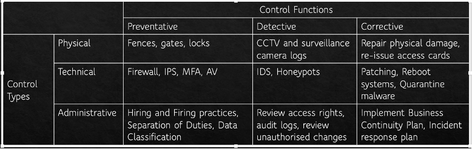

Computers including cyber concepts in week 1 and lab 3 
#### Cyber concepts in week1
**Information CIA**: Confidentiality, Integrity and Availability. CIA is sometimes extended to include Authentication, Accountability, Non-Repudiation and Reliability **信息CIA**:保密性、完整性和可用性。CIA有时会扩展到包括身份验证、责任、不可否认性和可靠性
**Confidentiality**: The property of information security that information is not made available or disclosed to unauthorised individuals, entities, or processes**保密性**:信息安全的属性，即不向未经授权的个人、实体或流程提供或披露信息
**Integrity**: Protects the reliability and correctness of data. Prevents unauthorized alterations of data. Protection against errors as well as deliberate changes**完整性**:保护数据的可靠性和正确性。防止未经授权的数据更改。防止错误和故意改变
**Availability**: Authorized subjects get timely and uninterrupted access to objects (the data and information they need)**可用性**:获得授权的受试者可以及时、不间断地访问对象(他们需要的数据和信息)
	
**Asset**: Anything of value to an organisation whose loss, or degradation of function would cause the organisation economic loss. Eg files, programs, databases, disks, laptops etc**资产**:任何对组织有价值的东西，其损失或功能退化会给组织造成经济损失。例如文件、程序、数据库、磁盘、笔记本电脑等
**Vulnerability**: weakness in an organisation’s assets that when exploited will lead to economic loss**脆弱性**:组织资产的弱点，一旦被利用将导致经济损失
**Threat**: anything that can exploit a vulnerability in a way that leads to a negative impact **威胁**:任何可以利用漏洞导致负面影响的东西
**Risk**: the probable frequency and probable magnitude of future loss from a threat acting on a vulnerability.**风险**:威胁对脆弱性造成的未来损失的可能频率和可能程度。
**Threat Actor**: Person, group or external force responsible for threats. External actors can be environmental: earthquakes, fire, flood, wind, etc. Internal actors may have motivation that is malicious or simply error**威胁行为者**:对威胁负责的个人、团体或外部力量。外部因素可以是环境因素:地震、火灾、洪水、风等。内部行为者的动机可能是恶意的或仅仅是错误的
**Threat Action**: What the threat actor did or caused e.g. malware, hacking, social, etc**威胁行动**:威胁行为者做了什么或造成了什么，例如恶意软件、黑客攻击、社交等
**Control**: measures that mitigate a risk. Types: physical, technical, administrative. Can be: Preventive, Detective, Corrective. Also known as a safeguard, security control, countermeasure, mitigation**控制**:降低风险的措施。类型:物理、技术、行政。可以是:预防，侦查，纠正。又称保障、安全控制、对策、缓解
Once a risk has been **identified**, it can be: Reduced or mitigated; Assigned or transferred; Accepted; Deterred; Avoided; Rejected or ignored一旦确定了风险，就可以:减少或减轻风险;指派的或转移的;接受;阻止;避免;拒绝或忽视
**Subject**: an entity such as a person, software process, computer, device that can access an object**主体**:可以访问对象的实体，如人、软件过程、计算机、设备等
**Object**: an entity that provides information to a subject. eg files, databases, programs, storage media, processes**对象**:向主体提供信息的实体。例如文件、数据库、程序、存储介质、进程

**Identity** is about being able to prove to a system that you are who you say you are**身份**是指能够向系统证明你就是你所说的那个人
**Authentication** verifies the identity using authentication factors:  Passwords, Smartcards, Tokens, Biometrics; 2FA (Two Factor Authentication): Something you know/have/do/ somewhere you are**认证**使用认证因素验证身份:密码、智能卡、令牌、生物识别;2FA(双因素认证):你知道/拥有/做的事情/你在某处
**Identity Management Systems** manage accounts and implement authentication schemes**身份管理系统**管理帐户和实施认证方案
**Authorization**: Determines what actions a subject can carry out on an object**授权**:确定一个主体可以对一个对象执行什么操作
Computer systems most commonly: Read, Write, eXecute; CRUD: Create, Read, Update/Insert, Delete最常见的计算机系统:读、写、执行;CRUD:创建、读取、更新/插入、删除
other **access control schemes**: Discretionary Access Control (DAC); Mandatory Access Control (MAC); Role-Based Access Control (RBAC); Rule-Based Access Control; Attribute Based Access Control其他**访问控制方案**:自主访问控制(DAC);强制访问控制(MAC);基于角色的访问控制;基于规则的访问控制;基于属性的访问控制
**Accountability**: To be able to identify all relevant information regarding actions in a system. Relies on identity and authorisation. Implemented with monitoring and logging**责任**:能够识别系统中有关操作的所有相关信息。依赖于身份和授权。通过监视和日志实现
	
### Risk Analysis
**Qualitative**: Assess risk in terms of rating risk on a scale **定性**:根据风险等级来评估风险
    Although simpler, it is not granular and so loses usefulness because of that虽然更简单，但它不是粒度的，因此失去了用处
**Quantitative**: Work out numbers for frequency of risk events based on detailed understanding of assets, threats and vulnerabilities**定量**:基于对资产、威胁和漏洞的详细了解，计算出风险事件发生频率的数字
    More complicated. Needs maturity and access to detailed organisational information更加复杂。需要成熟和访问详细的组织信息
Asset Valuation AV; Exposure Factor EF %; Single Loss Expectancy SLE = AV * EF; Annualized Rate of Occurrence ARO %; Annualized Loss Expectancy ALE = ARO% * SLE; Cost/Benefit of countermeasures资产评估AV;曝光系数EF %;单次损失预期SLE = AV * EF;年发生率ARO %;年预期损失ALE = % * SLE;对策的成本/收益
**Threat Analysis**: Who is the attacker; Why are they attacking; How are they attacking **威胁分析**:攻击者是谁;他们为什么要进攻?它们是如何进攻的
**Threat models**: 
•	PASTA: Process for Attack Simulation and Threat Analysis攻击模拟和威胁分析过程
•	STRIDE (Microsoft)  Threats related to software: Spoofing, Tampering, Repudiation, Information Disclosure, Denial of Service, Elevation of Privilege与软件相关的威胁:欺骗、篡改、拒绝、信息泄露、拒绝服务、特权提升
•	Attack Trees: Describe the steps needed for a threat to be actioned in a tree structure 攻击树:在树状结构中描述对威胁采取行动所需的步骤
•	Hybrid Threat Modeling Model: (SEI): Persona non Grata 混合威胁建模模型(SEI):不受欢迎的人
#### Vulnerability Assessment
•	Can be found through 3rd party information: US National Vulnerability Database; CVE (Common Vulnerability Exposures);CERTs (Computer Emergency Readiness/Response Team);VulnDB可以通过第三方信息找到:美国国家漏洞数据库;CVE(常见漏洞暴露);CERTs(计算机应急准备/响应小组);VulnDB
•	Identify vulnerabilities through: Asset management: what software, versions and patch levels; Vulnerability scans; Penetration Tests通过以下方式识别漏洞:资产管理:哪些软件、版本和补丁级别;漏洞扫描;渗透测试
	
•	Control examples

#### Lab3 Linux 
#### Linux command
•	pwd: print working directory
•	ls -al：list all the contents and in a long version 
•	cd: change directory
•	touch: create new file
•	cp: copy file. cp file1 file2
•	mv: rename file. mv file1 file2
•	rm: delete file
•	find: find <starting directory> -name <file to find>
•	ps -AF: shows all processes and extended information
•	kill -9 280: force the process with PID 280 to stop
•	whoami: get the currently logged in user
•	cat /etc/group: list all of the groups on the computer. the passwd file will list all of the users of the system
•	chmod u+x file: To mark a program as being executable for a user
•	-rwxrw-r-: 
•	- means it is a regular file. Other possible characters include d for directory, l for symbolic link
•	Owner Permissions (rwx): owner of the file can read write execute
•	Group Permissions (rw-): the group that the file belongs to can read and write
•	Other Permissions (r-): other users who are not the file owner or part of the group can only read
#### Linux file system
•	/: the root directory and only the user root has access to write in this directory. The user root's home directory is /root.
•	/bin: contains user binary executables like ps, ls, ping, grep etc. it is a symbolic link to /usr/bin
•	/sbin: contains system binaries like iptables, reboot, fdisk, ifconfig, etc.
•	/etc: contains configuration files and scripts for services running on the system. Also contains the passwd and shadow files that contain user and password information.
•	/dev: contains device files that are the interface with physical devices on, or attached to, the system such as tty devices /dev/tty1.
•	/proc: contains files that store information about system processes like uptime for example.
•	/var: contains files like logs (/var/logs), backups (/var/backups), mail (/var/mail) and spool (printing; /var/spool). There is also a /var/tmp directory that can be used to run programs out of. This directory does survive reboots however. The directory /var/www/html is often used as the root directory of the web server.
•	/tmp: contains temporary files as mentioned previously. Files get deleted on reboot.
•	/usr: contains user binaries, libraries, documentation and source code
•	/usr/local: contains users programs that you install from source.
•	/home: contains user home directories
•	/boot: contains boot loader files
•	/lib: contains system libraries
•	/opt: contains optional add-on applications
•	/mnt: is a location for mounting temporary filesystems
•	/media: is a location for mounting removable media devices like CDs
•	/srv: contains specific service related data
•	Users have a home directory which in Windows is usually located in c:\Users, on the Mac it is /Users and on Linux it is in /home. On this container, it will be empty because we only have one user, root, whose home directory is /root

