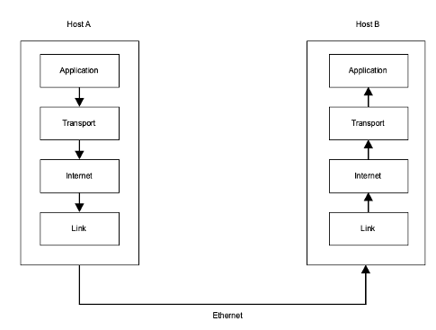

# Computers and Networks
## Computer Networking (lab)
### 1. Network Interface
1. To communicate with a TCP/IP network, a computer uses a network interface. This may be connected to a fixed network via an ethernet cable or via a Wi-Fi network. From a TCP/IP perspective, there is little difference and the attributes of the interfaces are the same. The main attributes we are interested in are:
为了与TCP/IP网络通信，计算机使用网络接口。这可以通过以太网电缆或通过Wi-Fi网络连接到固定网络。从TCP/IP的角度来看，两者的区别不大，接口的属性是相同的。主要属性有:

- Interface Name: usually

  - Mac: en0, en

  - Linux: wlan0, eth0

  - Windows: Local Area Network Connection, Ethernet Adapter Ethernet0, etc.

- IPv4 Address: IP version 4 address e.g. 192.168.0.5

- Subnet Mask: 255.255.255.0

- Default Gateway: Usually the address of your router e.g. 192.168.0.1
  默认网关:通常是路由器的地址
- DNS Server: Usually again, the address of your router or ISP DNS server.DNS服务器:通常还是你的路由器或ISP DNS服务器的地址

2.IP address command: `ip addr show`find your VM’s IP address
We can get these details using the command `ip addr` on Linux (or if you are on host, `ip addr` on Mac* and `ipconfig` on Windows).
我们可以在Linux上使用命令' ip addr '获得这些详细信息(或者如果你在主机上，在Mac*上使用' ip addr '，在Windows上使用' ipconfig ')

3. The main ethernet interface with the outside world is `eth0`. 与外界的主要以太网接口是“eth0”。

4. can use a `route` command,可以使用' route '命令
5. use `ping` below to scan the network but the way it works is to send a packet of a particular kind to the address and when received, the other host replies. Other than showing that there is a host responding at that address, you can also work out how far away it is because you get the round trip time使用ping来扫描网络，但它的工作方式是向地址发送特定类型的数据包，当接收到时，另一个主机会回复。除了显示在该地址有一个主机响应之外，您还可以计算出它有多远，
### 2. Scanning the network
- `nmap` performs scans on computer networks to detect if other devices are connected. If it finds a host, it can also scan for open ports that indicate specific services that the computer is using.在计算机网络上执行扫描，以检测是否有其他设备连接。如果它找到了一个主机，它还可以扫描显示计算机正在使用的特定服务的开放端口。
- `Ping Sweep` Finding other hosts and so we will be limiting the scan to what is called a Ping Sweep. When you ping another computer on the network, it involves sending a TCP/IP packet to the computer to say "are you there" to which the other computer usually replies and says "yes". 寻找其他主机，所以我们将限制扫描，所谓的Ping扫描。当你在网络上ping另一台计算机时，它包括向计算机发送一个TCP/IP数据包，说“你在那里吗”，另一台计算机通常会回答说“在”。
- `TCP/IP`: stands for Transmission Control Protocol/Internet Protocol and is a suite of communication protocols used to interconnect network devices on the internet.代表传输控制协议/互联网协议，是一套通信协议，用于互联互联网上的网络设备。
- `ICMP`: The Internet Control Message Protocol is a protocol that devices within a network use to communicate problems with data transmission. In this ICMP definition, one of the primary ways in which ICMP is used is to determine if data is getting to its destination and at the right time.互联网控制消息协议是一种协议，网络内的设备使用它来与数据传输进行通信。在这个ICMP定义中，使用ICMP的主要方法之一是确定数据是否在正确的时间到达目的地。
  
- `nmap` uses different ways of doing the same thing as a ping to determine if a computer is on the network. It isn't always reliable because sometimes computers are configured not to reply to pings, or a firewall will block them.使用与ping相同的不同方法来确定计算机是否在网络上。它并不总是可靠的，因为有时计算机被配置为不回复ping，或者防火墙会阻止它们。
   - Service discovery with `nmap`
   `nmap -sC -sV 172.17.0.1-3`
  - `-sC`: all scripts 
  - `-sV`: determine the versions of software providing the services discovered确定提供所发现服务的软件版本
  - `172.17.0.1-3`: specified the hosts to scan

### Terminology
  
- The Heartbleed Bug: a serious flaw in OpenSSL. 
  How it works: the SSL standard includes a heartbeat option, which allows a computer at one end of an SSL connection to send a short message to verify that the other computer is still online and get a response back.SSL标准包括心跳选项，它允许SSL连接一端的计算机发送一条短消息，以验证另一端的计算机仍然在线，并获得响应。

## Sniffing数据盗窃 
- Sniffing is a **passive** attack
  - active attack: an attacker interacts with the victim system主动攻击:攻击者与受害系统交互
  - passive attack: an attacker does not need the interaction被动攻击:攻击者不需要交互
- What is it: capture network traffic between two communicating nodes它是什么:捕获两个通信节点之间的网络流量
- Key characteristics?
  - Detection: hard to detect such attacks, as the attack does not leave any traces in the network.检测:很难检测到这种攻击，因为攻击不会在网络中留下任何痕迹。
  - Prevention: can be prevented via encryption预防:可以通过加密进行预防

There are a list of tools for sniffing e.g., Wireshark, tcpdump.有一个嗅探工具列表，
  

### Architecture
Boot Process- Firmware in the ROM will run the Basic Input Output System(BIOS) which will perform a Power On Self Test(POST) which checks that all hardware is operational, the BIOS will then run the first 512 bytes in the Master Boot Record(MBR) the which is a hard drive that contains the bootloader which will run the Operating System(OS). ROM中的固件将运行基本输入输出系统(BIOS)，该系统将执行开机自检(POST)，检查所有硬件是否正常运行，BIOS将在主引导记录(MBR)中运行前512字节，这是一个包含引导加载程序的硬盘驱动器，将运行操作系统(OS)。
Parts-
- CPU: Central processing unit – process instructions stored in memory处理存储在内存中的指令
- RAM: Random Access Memory – small size fast acting memory close to cpu.靠近CPU的小尺寸快速内存
- ROM: Read Only Memory – memory stored only to be read not altered.仅供读取而不修改的内存。
- System Bus: Contains Address Bus that transports file location in memory, Data Bus that transports the actual data, and Control Bus that dictates the flow of data.包含在内存中传输文件位置的地址总线、传输实际数据的数据总线和指示数据流的控制总线。
- PSU: Power Supply Unit
- Fan: Fan
- Video Card
- Hard Drive
- Motherboard
- Network card: Wired and/or Wireless (NIC or WNIC)
  
Kernal- the core commands of the cpu that is closest to critical system functions, protected by Ring 0 which only trusted mechanisms can act in.内核- cpu的核心命令，最接近关键系统功能，由Ring 0保护，只有可信机制可以在其中起作用。

Processes- aspects of programs that run within the processors of a CPU, multicores and multithreading allow for more than one process to be run.进程——在CPU的处理器内运行的程序的各个方面，多核和多线程允许运行多个进程。

   - States:
     - Start- Initial state.初始状态
     - Ready- Waiting to be assigned a processor.等待分配处理器
     - Running- Processor running instructions.处理器运行指令。
     - Waiting- Waiting on resource.等待资源
     - Exit- Waiting to be removed from memory.等待从内存中删除
   - Attributes:
     - Process ID (pid)- unique numeric id
     - Parent- All processes are started by another process, this is that process and some permissions and attributes may be passed down, shown by Parent Process ID(ppid).父进程-所有进程都是由另一个进程启动的，这是指进程和一些权限和属性可能被传递下来，由父进程ID(ppid)显示。
     - Files- Procceses work on files.
     - Virtual Memory- Process that needs more than assigned memory will have memory that is just written to disk.需要比分配的内存更多的内存的进程只需要将内存写入磁盘
  
Networking- The TCP/IP model which the wifi and internet use is comprised of several layers that each add a new piece of data to the packet to allow it to travel through that layer with the link layer being the physical ethernet cables.
网络——wifi和互联网使用的TCP/IP模型由几层组成，每层都向数据包添加一个新的数据片段，以允许它通过该层，链路层是物理以太网电缆。

   - Media Access Control(MAC) address- each NIC has a unique id of form f8:ff:c2:01:fa:e5每个网卡都有一个唯一的形式id
   - IP address- of IPv4 or IPv6 this identifies computers or networks uniquely, things like websites use an IP address that is changed to words through a Domain Name Server(DNS) and to avoid duplicates DNS are managed by Internet Service Providers(ISPs).IP地址——IPv4或IPv6的唯一标识计算机或网络，像网站这样的东西使用IP地址，通过域名服务器(DNS)更改为单词，为了避免重复，DNS由互联网服务提供商(isp)管理
   - Network Address- each home network is connected to the internet via a router but that is not necessary for communication in the home subnetwork, there can be 254 hosts on a subnet with the notation 130.95.1.0/24 where the last bit is the host.网络地址——每个家庭网络都通过路由器连接到互联网，但这对于家庭子网中的通信是不必要的，在一个子网中可以有254台主机，标记为130.95.1.0/24，其中最后一位是主机。
   - Application Port- which application we give a packet to at the application layer is defined by a port from 0 to 65536.应用程序端口——我们在应用层向哪个应用程序发送数据包是由一个从0到65536的端口定义的
   - Router- sorts packets to their intended destination without knowing the full path but instead identifying the next best router for the packet’s goal.路由器——在不知道数据包完整路径的情况下，将数据包分类到预定目的地，而是为数据包的目标确定下一个最佳路由器。
   - Firewall- Firewalls read incoming traffic and block based on a set of defined rules such as banned IPs or potentially malicious files.防火墙——防火墙读取传入的流量，并根据一组定义的规则(如禁止的ip或潜在的恶意文件)进行阻止。
   - Hypertext Transfer Protocol- HTTP operates on the application layer and uses Uniform Resource Locators(URL) to fetch and display specific files. HTTP itself is unencrypted and unsecure.超文本传输协议——HTTP操作于应用层，使用统一资源定位器(URL)来获取和显示特定的文件。HTTP本身是未加密且不安全的。
   - HTTPS- where S is for Secure, uses SSL and TLS. TLS use certificates from public keys from a Certificate Authority to trust web servers.HTTPS——S代表安全，使用SSL和TLS。TLS使用来自证书颁发机构的公钥证书来信任web服务器
   - TLS1.3 Steps-
▪ Agree the cipher that will be used同意将要使用的密码
▪ Which key exchange protocol to use使用哪种密钥交换协议
▪ Create and share keys创建和共享密钥
▪ Check server and client identity through certificates通过证书检查服务器和客户端身份
   - Virtual Private Networks- VPNs work by connecting your device to a distant network to give it a new IP which makes it appear as if you were in another country, it is also encrypted and so long as the VPN provider does not keep logs it is private, however your internet activity is not anonymous.虚拟专用网络- VPN的工作方式是将您的设备连接到远程网络，给它一个新的IP，使它看起来好像您在另一个国家，它也是加密的，只要VPN提供商不保留日志，它就是私有的，但是您的互联网活动不是匿名的。
   - The Onion Routing project(TOR)- TOR uses many nodes or servers and uses their encryption keys and data flows using a random path and when it reaches an exit node, the website youre trying to reach will only know that exit node making it almost completely anonymous.洋葱路由项目(TOR)- TOR使用许多节点或服务器，并使用随机路径使用它们的加密密钥和数据流，当它到达一个出口节点时，你试图到达的网站将只知道该出口节点，使其几乎完全匿名。
   - Dark Web- many TOR access sites are onion sites which don’t use standard URLs and thus are unindexed to normal search engines, with this and the anonymity the Dark Web became a hotspot for illegal trade.暗网——许多TOR访问网站都是洋葱网站，它们不使用标准的url，因此没有被正常的搜索引擎索引，这一点和匿名性使暗网成为非法交易的热点。

### Q&A
1. Insecure channel is not encrypted, e.g., http. Secure channel is encrypted, e.g., https.
不安全通道未加密，如http。安全通道是加密的，例如https。
- Why is https secure?
  - SSL/TLS protocol
  - SSL: Secure Socket Layer
  - TLS: Transport Layer Security
  - Is https 100% secure?
    - a gap between theory and implementation, e.g., heartbleed
  
2. Is sniffing attack a concern with all the advances in cybersecurity today?S嗅探攻击是当今网络安全进步的一个关注点吗?
e.g., cloud computing vs IoT
Cloud providers guarantee data security and privacy. 
IoT vendors focus more on performance
3. What conditions would make sniffing attacks more likely to succeed?什么条件会使嗅探攻击更有可能成功?
e.g., a non-encryption or weak-encryption channel
4. What is Remote Shell: remotely execute shell commands on a target system over the internet. 
shell commands, e.g., create/edit/remove files and folders, fetch data, and launch applications
什么是远程Shell:通过internet在目标系统上远程执行Shell命令。
Shell命令，例如，创建/编辑/删除文件和文件夹，获取数据和启动应用程序
Two types:
Forward shell
The malicious client executes shell commands on the server恶意客户端在服务器上执行shell命令
Reverse shell
The malicious server executes shell commands on the client恶意服务器在客户端执行shell命令
`$`: a normal user
`#`: a root user

5. In what scenarios forward shell is useful?在什么情况下正向shell是有用的?
   e.g., steal/delete/lock sensitive data stored in a high-value server. 

6. What are possible methods we can use to mitigate forward shell?我们可以使用哪些可能的方法来减轻正向壳?
 e.g., regular security patches to software

7. Reverse shell
The malicious server executes shell commands on the client恶意服务器在客户端执行shell命令

8. Is reverse shell as easy as forward shell? Why?逆壳和正壳一样容易吗?为什么?
No, e.g., a high-value server might enforce more strict security polices, compared to a client.
 
9. Malicious use: remote shell can be abused by malicious users to cause system damage.恶意使用:远程shell可被恶意用户滥用，造成系统破坏。
e.g., delete all files on the system, stealing and/or corrupting  sensitive data
