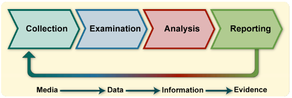
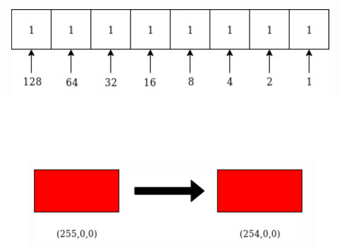
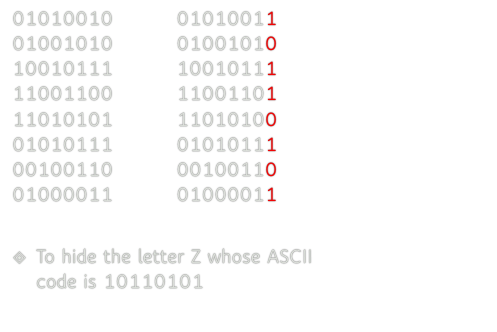

# Digital Forensics数字取证：分析数字媒体以检测伪造或篡改
## vocabulary
Steganography隐写术

#### 1. All digital contact leaves traces:所有数字接触都会留下痕迹:
Browser history浏览历史 
Logs (logins, logouts, other events)日志(登录、注销、其他事件)
File creation, modification dates文件创建、修改日期
Document metadata such as author, version history文档元数据，如作者、版本历史
Backup files备份文件
Communications: email, messages通讯:电子邮件、信息

#### 2. Digital data may be present on a range of devices such as 数字数据可能出现在一系列设备上，例如
Hard drives
Computer memory
Peripheral device memory (such as in printers) , 外围设备存储器
Removable drives like USB drives
Smartphones
IoT, 
Cars - through navigation and entertainment systems.

#### 3. Legal Issues with Digital Evidence数字证据的法律问题
Proving attribution is sometimes hard 证明归因有时很难
  eg. “Someone else used my WiFi”如。“有人用了我的WiFi”
Evidence was not tampered with or altered 证据没有被篡改或改变
Having correct search warrants 有正确的搜查令
Searching for one thing and then discovering evidence for a different crime寻找一件事，然后发现另一件事的证据
Destruction of evidence by parties 当事人销毁证据

#### 4. The Forensic Process

. Collection of Data数据收集
   1. Establishing data provenance and maintaining integrity建立数据来源并维护完整性
   2. Identify possible sources of data确定可能的数据来源
   3. Securing devices before someone is able to delete files or tamper with evidence is critical – although it is often possible to recover files that the user has thought they deleted在有人能够删除文件或篡改证据之前保护设备是至关重要的——尽管用户通常有可能恢复他们认为已经删除的文件
   4. Data may be in encrypted forms which are potentially recoverable through access to memory where it is held in plaintext, decryption by knowing the keys or through some other technique数据可能是加密的形式，可以通过访问存储在明文中的内存来恢复，通过知道密钥或通过一些其他技术来解密
   5. Data can be collected from live machines and also from disks and memory devices that are “dead”数据可以从运行的机器中收集，也可以从“死机”的磁盘和内存设备中收集。
   6. Data is copied from storage and other devices in a bitwise manner i.e. getting an image of raw data数据以位方式从存储器和其他设备中复制，即获取原始数据的图像
   7.  We don’t use a logical data acquisition process using other layers to access or copy files我们不使用逻辑数据采集过程，使用其他层来访问或复制文件
   8.  Main decisions in data acquisition数据采集中的主要决策
        1. Likely value of the data to achieve its objectives数据实现其目标的可能价值
        2. Volatility being aware that data may disappear if machines are powered down, files may be updated etc不稳定性是指如果机器断电，数据可能会消失，文件可能会更新等
        3. Focus on amount of effort required 关注需要付出的努力
        4. Once data is acquired, needs to be verified一旦获得数据，需要进行验证
   
. Examination检查
1. Use of tools to assist in examination of data of recovering files of interest,使用工具协助检查有关文件的资料; 
    1. Analysis of hard drives and smartphones: Autopsy/The Sleuth Kit硬盘和智能手机的分析:尸检/侦探工具包
    2. Memory Analysis: Volatility 3 内存分析:波动性3
    3. Windows specific forensics: Arsenal Recon: Registry (Live and Hive), Disk Images, Hibernation filesWindows特定的取证:兵工厂侦察:注册表(Live和Hive)，磁盘映像，休眠文件
    4. Network Analysis: Wireshark网络分析:Wireshark
    5. Mobile device forensics: iPhone Backup Analyzer, iExplorer, Autopsy, Scalpel, FTK Imager移动设备取证:iPhone备份分析仪，iExplorer，尸检，手术刀，FTK成像仪
2. Examination will use these tools to recover files and information from memory检查将使用这些工具从内存中恢复文件和信息

. Memory capture and analysis记忆捕捉和分析
1. Can capture memory on machines using tools such as AVML (https://github.com/microsoft/avml) or FTK Imager that produces a memory snapshot 可以使用AVML或FTK Imager等产生内存快照的工具在机器上捕获内存
2. Using a memory analysis tool Volatility, we can analyse the image created in the previous step.使用内存分析工具波动性，我们可以分析在上一步中创建的图像。
3. To process an image with Volatility we need to specify the profile of the memory image which matches the operating system version of the memory dump. 要处理带有波动性的映像，我们需要指定与内存转储的操作系统版本相匹配的内存映像的配置文件
4. You can then analyse the dump for artifacts using a set of plugins that are available to read:然后，您可以使用一组可用的插件来分析工件转储:
    1. Network information网络信息
    2. Process information: detect if malware was running进程信息:检测是否有恶意软件运行
    3. Kernel modules that were loaded 加载的内核模块
    4. Files in use by processes进程正在使用的文件
    5. Command line commands and output命令行命令和输出
 5. List the processes that were running and search for anything unusual such as malware列出正在运行的进程并搜索任何异常情况，例如恶意软件
 6. Dump the process and associated memory in order to analyse it further转储进程和相关内存，以便进一步分析它
    1. Look for strings in the process that help identify malware查找过程中有助于识别恶意软件的字符串
    2. Identify user credentials such as usernames and passwords 识别用户凭据，如用户名和密码
    3. Other details
 7. Dump the files that are open in memory to examine the contents转储在内存中打开的文件以检查其内容
 8. Can read contents of files, registry, clipboard, history of commands typed in shells or cmd.exe and output of those commands可以读取文件，注册表，剪贴板的内容，在shell或cmd.exe中键入的命令的历史记录和这些命令的输出
 9. Network information will say where and with who the machine was communicating网络信息将显示机器在哪里与谁通信
    1. Malware contacting command and control servers恶意软件联系命令和控制服务器 
    2. Data being exfiltrated 数据正在被泄露

. Analysis
 1. Analysis is going to be led by the crime being investigated分析将以正在调查的犯罪案件为主导
 2. Attribution: attributing actions to an individual。归因:将行为归因于个人
 3. Alibis and statements: cross-checking information provided by individuals with digital evidence。不在场证明和陈述:交叉核对个人提供的数字证据信息
 4. Intents: In addition to finding objective evidence of a crime, intent (legal term mens rea) can also be explored。意图:除了寻找犯罪的客观证据，意图(法律术语指意图)也可以探讨
 5. Will examine evidence in the form of Audio, images and video files 会以音频、图像和视频文件的形式审查证据
 6. Evidence is accumulated that is related to the crime:收集到的与犯罪有关的证据:
    1. Timelines of activities活动时间表
    2. Locations of suspects and defendants嫌疑人和被告的地点
    3. Activities on the computer电脑上的活动

#### 5. Image 
1. Image files come in a variety of different formats but contain图像文件有各种不同的格式，但包含
   1. Formats include JPEG, TIFF, GIF, BMP, PNG
   2. Data: pixels which are represented by n bits to represent amount of red, green and blue数据:像素，用n位表示红、绿、蓝的数量
   3. Data can be raw or compressed using lossless or lossy compression数据可以是原始数据，也可以使用无损或有损压缩进行压缩
   4. Data can be held as a raster format or vector format数据可以保存为栅格格式或矢量格式
2. Image files may contain EXIF (Exchangeable Image File Format) data that contains information about the camera that took the image, the image details, date and time and most importantly geolocation data图像文件可能包含EXIF(可交换图像文件格式)数据，其中包含有关拍摄图像的相机，图像细节，日期和时间以及最重要的地理位置数据的信息
   
. Image Analysis Techniques
1. Variety of methods of analysing images各种分析图像的方法
2. Principle Component Analysis (PCA)主成分分析(PCA)
3. Error Level Analysis (ELA)错误级别分析(ELA)
    1. Each time a JPEG is saved it creates errors which gets progressively less with each save每次保存JPEG都会产生错误，每次保存都会逐渐减少错误
    2. ELA involves saving image to known level and then detecting the error differenceELA包括将图像保存到已知的级别，然后检测误差差
    3. New changes are impacted more than the original新的变化比原来的影响更大
   
#### 6. Steganography
It is the practice of concealing a message, file, or other form of data within another file, or medium in order to hide the data’s existence这是一种将消息、文件或其他形式的数据隐藏在另一个文件或媒体中的做法，以隐藏数据的存在
1. Message is hidden in another medium such as images, audio or webpage so that the message is hidden even in plain view信息隐藏在另一种媒介中，如图像、音频或网页，这样信息即使在普通视图中也是隐藏的
2. The other medium is the carrier file另一种介质是载体文件
3. Two forms
    1. Insertion: hidden text is added to the existing carrier插入:将隐藏文本添加到现有的载体中
    2. Substitution: bits of the carrier are replaced with the bits from the message替换:载体的位被替换为消息中的位
4. various mediums各种媒介
    e.g., text, image, video, audio, network
5. text steganography: e.g., alignment, font, position, white space文字隐写术:例如:对齐、字体、位置、空白
    1. Alignment: The alignment of certain letters or words within a text can be used to hide a secret message.对齐:文本中某些字母或单词的对齐可以用来隐藏秘密信息
    2. Font: The font itself can be used to hide a secret message.字体:字体本身可以用来隐藏秘密信息 
    3. Position: The position of letters or words within a text can be used to hide a secret message.位置:文字中字母或单词的位置可以用来隐藏秘密信息
    4. White Space: The blank spaces or unused areas within a text are used to hide a secret message. Encode by the number of white spaces at the end of each line. no space denotes 0, extra space denotes 1.空白:文本中空白或未使用的区域用于隐藏秘密信息。按每行末尾的空格数进行编码。没有空格表示0，多余的空格表示1。
   
#### 7. image steganography: 
1. LSB Substitution: In a byte, the bit representing 1 is the least significant bit (LSB). We can change the bit without changing the colour to the human eye LSB替换:在一个字节中，表示1的位是最低有效位(LSB)。我们可以在不改变人眼颜色的情况下改变比特
       
    
    1. LSB (Least Significant Bit), PVD (Pixel-Value Differencing)
       1. LSB: LSB of each pixel is replaced with a bit of the secret message to be hidden. 每个像素的LSB被替换为一个要隐藏的秘密信息
       2. PVD: modifies a pair of two adjacent pixels' values at one time to hide secret bits.一次修改一对相邻像素的值以隐藏秘密位。
2. RGB: stands for Red, Green, and Blue. It is a color model to represent colors in digital images and on computer screens. In this model, each color is represented by 8 bits (0-255). RGB:代表红、绿、蓝。它是一种在数字图像和计算机屏幕上表示颜色的颜色模型。在该模型中，每种颜色由8位(0-255)表示。
    0000 0000 -> 0
    1111 1111 -> 255
3. Pixel: is the smallest unit of an RGB image. It has an RGB (3 colors) value and a location in an image. Its 3 colors are determined by its RGB value. 像素:是RGB图像的最小单位。它具有RGB(3种颜色)值和图像中的位置。它的3种颜色由它的RGB值决定。
    1. Greyscale Image: consists of shades of gray, varying from black to white, with different shades of gray in between. A shade of gray is represented by 8 bits or 16 bits. 灰度图像:由从黑色到白色不等的灰度组成，中间有不同的灰度。灰色阴影由8位或16位表示。
    2. Pixel: is the smallest unit of an image. It has a single value (0 to 255 for 8-bit images) or (0 to 65,535 for 16-bit images). 像素:是图像的最小单位。它有一个单一的值(8位图像为0到255)或(16位图像为0到65,535)。
       0000 0000 0000 0000
       1111 1111 1111 1111
        
    
#### 8. File System Analysis: Deleted Files文件系统分析:删除文件
Searching for deleted files that are deallocated but not erased搜索已删除但未删除的文件

#### 9. File System Analysis: Slack Space文件系统分析:闲置空间
1. When disk space is allocated to a file it is done in 512 byte sectors. If the file does not fill the available space there is space left over – slack space当将磁盘空间分配给文件时，它是在512字节扇区中完成的。如果文件没有填满可用空间，就会有剩余空间——闲置空间
2. This may contain left-over remnants of other files and so contain valuable information这可能包含其他文件的残余物，因此包含有价值的信息

   
## Q&A
1. How difficult/easy is it to detect text steganography?检测文本隐写有多困难/容易?
If it is easy, we assume the text steganography techniques are already known to us. 
If it is difficult, we can assume it is hard to know the techniques in practice.
如果很容易，我们假设文本隐写技术已经为我们所知。
如果很难，我们可以假设在实践中很难掌握这些技术。
2. Compare position with key against white space?比较位置与键对空白?
For position w/ key, a key specifies the positions of secrets. The secrets are from the original text. The file size does not change.对于位置w/ key，一个键指定秘密的位置。秘密来自原文。文件大小不变。
For white space, blank spaces or unused areas are used for hiding secrets. The file size does change.对于空白区域，使用空白区域或未使用的区域来隐藏秘密。文件大小不会改变。
3. LSB: embeds three secret bits per pixel in an RGB image. Why 3 bits?LSB:在RGB图像中每像素嵌入三个秘密比特。为什么是3位?
A pixel has an RGB value of (X, Y, Z). X, Y, and Z are respectively represented by 8 bits and LSB of each 8 bits can be modified. 每个像素的RGB值为(X, Y, Z)， X、Y、Z分别用8位表示，每8位的LSB都可以修改。
4. A secret bit stream of 101 101 101 needs to be hidden. How many LSBs will be changed at least? 需要隐藏101 101 101的秘密比特流。至少要更改多少个lsbs ?
   4
   
5. Can we use MSB for image steganography? Why or Why not?我们可以使用MSB进行图像隐写吗?为什么或为什么不?
    NO, that will change the RGB value.
    

6. What kinds/types of images are more resistant to image steganography?哪些类型的图像更能抵抗图像隐写?
Lossless compression images, e.g., PNG or BMP无损压缩图像，如PNG或BMP

    
 